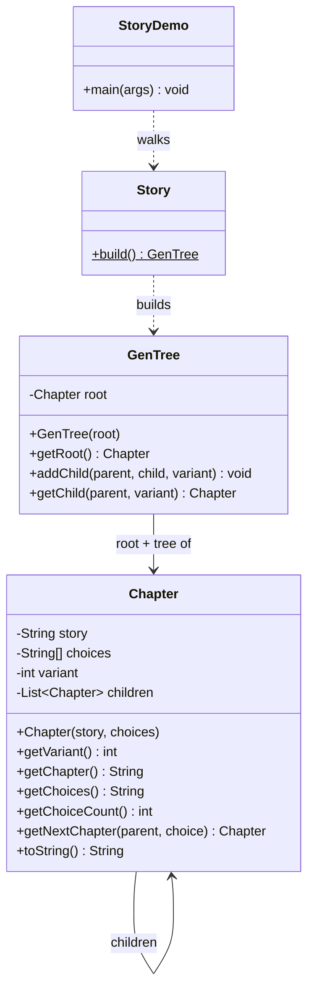

# System Diagram — Chapter / Tree / Choices (Sophia's part)

## Flow

1. `Story.build()` creates each `Chapter` (story text + choice text) and wires them together with `GenTree.addChild(parent, child, variant)`, where `variant` is the branch number that choice leads to.
2. `GenTree` validates that a parent is actually part of the tree before attaching a child, and that root is never null.
3. `GenTree.getChild(parent, variant)` / `Chapter.getNextChapter(parent, choice)` walk from a chapter to the correct child based on the player's numeric pick.
4. `StoryDemo` is a minimal console walker that prints each chapter's `toString()` (story + numbered choices), reads a number, validates it, and advances until it reaches an ending chapter (one with zero choices).
